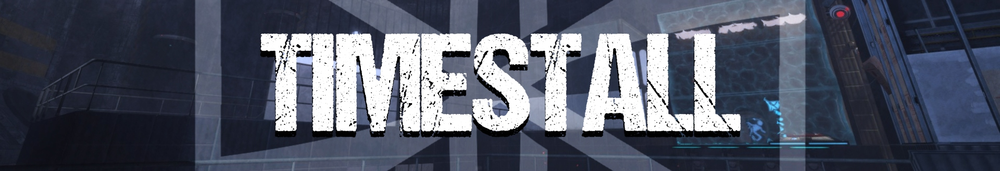
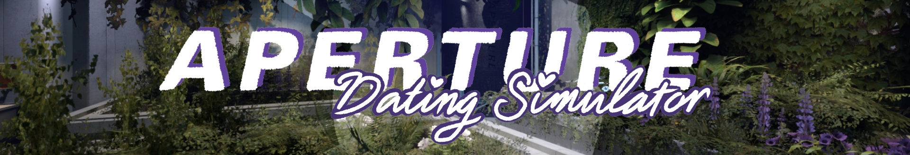
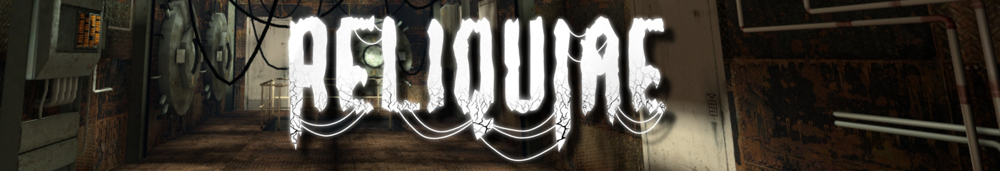

CMYKollective is a publisher prioritizing unique and different stories told through unconventional means. Currently, we support four projects, all of which are independently run and managed by individual teams.

Most of our work is done within the Source engine or with projects that relate in some way to Source. Many of our members have experience working on projects such as Portal 2: Community Edition and Portal: Revolution.

CMYKollective specializes in sponsoring interesting and engaging stories that speak for themselves, but provides support in the form of additional resources, asset and trailer creation, and social media management.

You can see some of our currently-featured projects below.

# Projects

## Portal: TIMESTALL *(TBD)*

> A brand-new, free modification for Portal 2: Community Edition. Take control of a man who's lost his memory as you venture through a surprisingly vacant facility, mangling the flow of time and space as you do.

Developed By: CMYKollective
Led By: Qquash

[Discord Server](https://discord.gg/TU9T2t4pW2)

[Announcement Trailer](https://www.youtube.com/watch?v=QLxw7hescxg)

---

## Aperture Dating Simulator *(2025)*

> APDS is a comedy, a tragedy, a romance - all three if you're dumb enough. It's 7 different genres cosplaying as a visual novel. Choose your date from 7 different unique personality cores.

Developed By: Ashleyanna Rivers

[Official Itch Release](https://ashleyanna.itch.io/apds)

[Discord Server](https://discord.gg/GedmcRdXBj)

[YouTube Channel](https://www.youtube.com/@ApertureDatingSimulator)

### Aperture Dating Simulator: Double Down *(~2026)*

Developed By: Ashleyanna Rivers

> Ten years before the events of the original game, Aperture continues to struggle financially under the leadership of the - still alive - CEO, Cave Johnson. To combat this, the financial sector comes up with a wild idea... the Aperture Casino & Bar!

[Official Announcement](https://www.youtube.com/watch?v=H8KlihwWseg)

---

## Reliquiae *(~2027)*

> You are awoken as the last test subject in an unknown part of the facility. You follow your "testing track" through offices, run-down storage areas, and abandoned puzzles - but the AI says this route is your intended one...

Developed By: Jar of Dirt
Led By: Hazel Webbs

[Discord Server](https://discord.gg/rNMgFdAtGk)

[Steam Page](https://store.steampowered.com/app/3923570/Reliquiae/)

[Pre-Release Trailer](https://www.youtube.com/watch?v=6u31ZeMAxKI)

